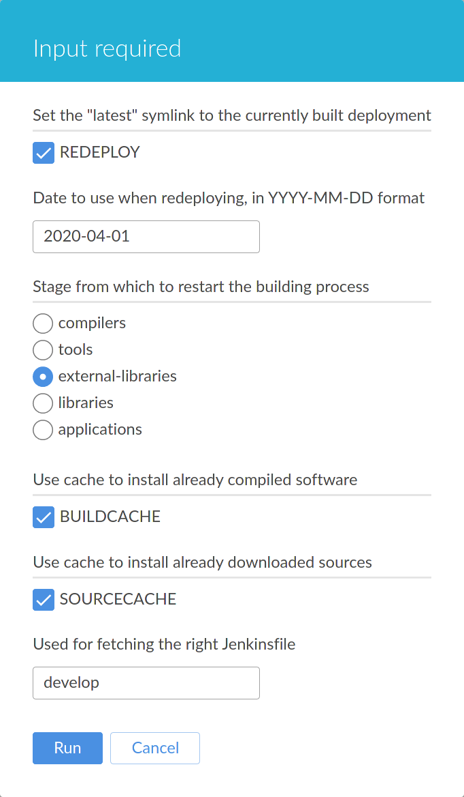

# Workflows

## Redeployment of a Stage

As the number of different versions of software in a stage grows, it may be
beneficial to redeploy stages into a new directory to keep the Spack
database lean and fast to query.

To redeploy a stage and all its dependents, visit our
[Deployment Jenkins Overview](https://bbpcode.epfl.ch/ci/blue/organizations/jenkins/hpc.spack-deployment/activity/),
and click the button labelled "Run".
The following dialog should appear:

Ensure that the following items are changed:

* The checkbox `REDEPLOY` should be checked.

  This will deploy into the specified folder (see next item), and after
  successful deployment reset the `latest` symlink to said folder.
  Future deployment runs will then use the new deployment by default.

* The date field should have `latest` replaced with an actual date like
  `2020-04-01`.

  The deployment resolves the symlink `latest` to the last redeployment.
  If this field is not set to an actual date, no new deployment will be
  created, but the lastest deployment will be updated.

* Select the appropriate stage to redeploy.

  Note that the content of the earlier stages, e.g., `compilers`, `tools`,
  evolves only slowly, and redeployment should only be done infrequent.

## Updating with a new Upstream Spack
